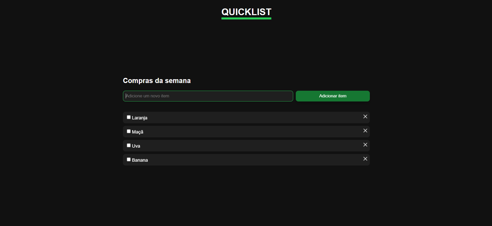

# CONVERT

## 💻 Sobre o Projeto

Projeto para lista de compras (adicona itens, remove). Segundo projeto aprendendo javascript.

## ✨ Tecnologias

Liste as principais tecnologias, frameworks e linguagens utilizadas.

-   **Frontend:** `[HTML, CSS, JavaScript]`
-   **Ferramentas:** `[Git, Figma, VS Code]`
